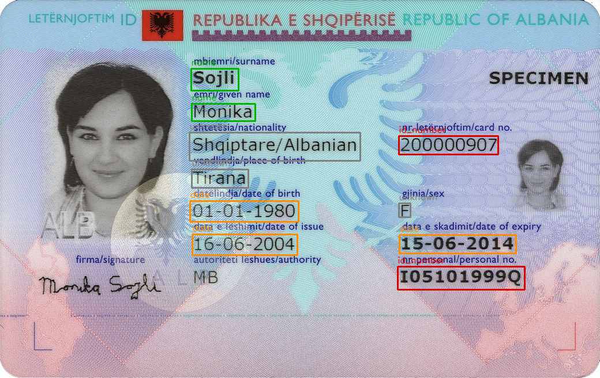

# docvalue-extract

Field-level value extraction for identity documents. Given a document
image, it returns the filled-in value fields like name, date of birth,
document number, address, each with a bounding box, a semantic type,
the recognized text, and per character bounding boxes. On an RTX 5080, a
single document runs end-to-end in roughly 5-10 seconds once the model
is loaded.

## Example

Extracted value-field boxes on a public EdisonTD specimen (Albania ID).
Green = name, orange = date, red = ID number, grey = other. Printed
labels are correctly left unboxed.



## Why value fields and not the whole document?

The original purpose of this pipeline was to prepare a document for a downstream fraud classifier focused on 
text-manipulation. Consider a legitimate government issued document that an individual has
altered to hide or change their identity. The edits are in the values,
like a date pushed forward by two years, or a swapped name, and not the
printed template labels, the document layout, or other substrate
characteristics. Working at the field level, rather than on the
whole-document image, is what lets downstream classifiers run across
issuing authorities, and reduces the input variation they have to handle. Although the pipeline was
initially meant to feed classifiers, it applies anywhere you need structured values out of visually varied
documents. A few that come to mind are PII redaction (it locates every sensitive field), dataset creation, and accessibility for
visually impaired users.

## How it works

Four stages:

1. **Localization (EasyOCR).** Finds every text region and returns
   axis-aligned boxes. This is very accurate for smartphone captured
   identity documents, even under relatively bad conditions.
2. **Semantic value identification (Qwen2.5-VL-7B).** Reads the image
   and decides which text is a filled-in value versus a template label,
   returning `{text, field_type}` pairs. A heavy vision-language model is
   used deliberately here because I know that it generalizes across
   issuing authorities and scripts without per-jurisdiction rules. It can
   easily recognize that `niebieskie` is an eye-color *value* and
   `DATA URODZENIA` is a *label*.
3. **Fuzzy alignment.** Matches each VLM value to its OCR-grounded bbox
   (three tiers: exact, substring, character-overlap).
4. **Character contour detection.** Locates individual character bboxes
   within each field. These can be used by systems ingesting fields and
   characters separately, through attention between them, or other
   mechanisms.

The output is a set of independent field records.

## Benchmark

The Qwen model, under a similar prompt and value-identification
configuration to the one this pipeline uses, achieves a 97.3% field
extraction success rate across 6,407 document samples spanning 223
countries, territories, and 49 document types. Full per-country and
per-document-type results: https://authorize.earth/products/benchmarks/

## Smaller models

The VLM is swappable via `--vlm-model`. In brief testing, the smaller
Qwen2.5-VL-3B still finds most value fields and still skips the labels,
but it misses a few short, low-signal fields the 7B catches, and it is
less reliable at typing (dates and ID numbers get labeled `unknown`).
The 7B default is used because it types fields reliably and is the
version that is benchmarked.

## Install

```bash
pip install -r requirements.txt
pip install flash-attn --no-build-isolation   # optional; needs matching CUDA/torch
```

## Run

```bash
python examples/run.py document.jpg --out fields.json --overlay boxes.png
```

`fields.json` contains the extracted fields; `boxes.png` draws the boxes
on the source image. Add `--show-chars` to draw character boxes,
`--no-chars` to skip Stage 4, `--lang en pl de` for multilingual OCR, and
`--vlm-model <hf-id>` to swap the VLM (e.g. `Qwen/Qwen2.5-VL-3B-Instruct`).

## Hardware

Qwen2.5-VL-7B in bf16 needs roughly 18 GB of VRAM. It fits comfortably on
a 24 GB+ card. On 16 GB cards, cap the input resolution (via the
processor's `max_pixels`). I have not tested quantization.

## License

This project is MIT-licensed. Qwen2.5-VL-7B has an Apache 2.0 license.
EasyOCR has an Apache 2.0 license.
